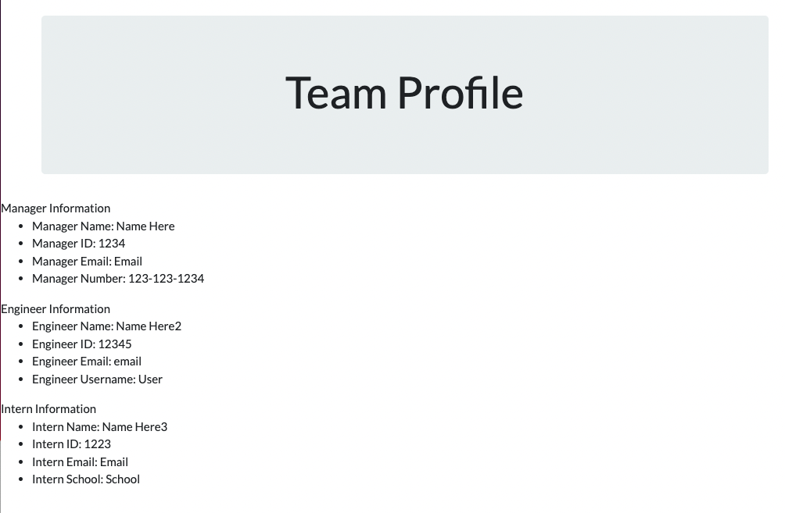

# Team_Profile_Generator

## Description

This is a project that will allow a user to generate a team profile using the terminal command line. 

## Installation

1. Open VS Code Terminal
2. Enter `npm i` OR `npm i inquirer@8.2.4` into the command line

## Usage

1. Open "TEAM_PROFILE_GENERATOR" in Visual Studio Code
2. Open Integrated Terminal
3. Install Inquirer (refer to steps above)
4. Type "node index.js" into the command line
5. Answer the prompted questions to complete your team
6. Open the ""team.html" file to view your creation!

Please see the video below for an example of how this project works:

https://www.awesomescreenshot.com/video/12037056?key=322218eb50bf38eda06ef1f6b0a36c9c

Here is an example of the Team Profile to be created after your input:

## Ideas for future development

With more time, I plan to futher develop and polish this project. My plans are detailed in the pseudocode.md file.

## Credits

Referenced previous class assignments and practices. 

## License

  
---
